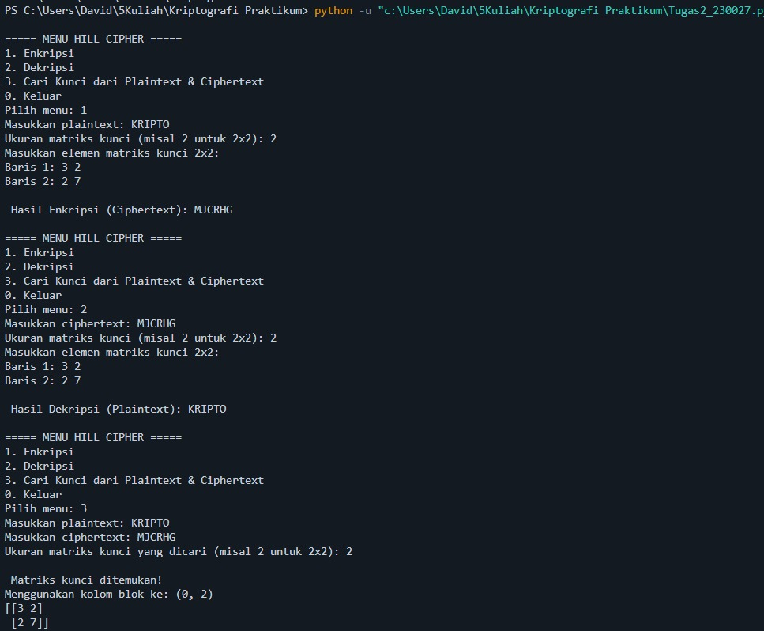

# 🔐 Program Hill Cipher (Enkripsi, Dekripsi, dan Pencarian Kunci)

Program ini dibuat menggunakan **Python** dengan tujuan untuk:

1. Melakukan **enkripsi** teks (plaintext) menjadi ciphertext menggunakan algoritma **Hill Cipher**.
2. Melakukan **dekripsi** ciphertext kembali ke plaintext menggunakan matriks kunci.
3. Mencari kembali **matriks kunci** dari pasangan plaintext dan ciphertext yang diketahui.

---

## ⚙️ Fitur Utama

* **Enkripsi (Menu 1)**
  Mengubah plaintext menjadi ciphertext menggunakan matriks kunci yang dimasukkan user.

* **Dekripsi (Menu 2)**
  Mengubah ciphertext menjadi plaintext kembali menggunakan matriks kunci.

* **Cari Kunci (Menu 3)**
  Menemukan matriks kunci dari pasangan plaintext dan ciphertext (brute force pada blok yang invertible).


## ▶️ Cara Menjalankan

1. Jalankan program:

   ```bash
   python hill_cipher.py
   ```

2. Pilih menu:

   * **1 → Enkripsi**
   * **2 → Dekripsi**
   * **3 → Cari Kunci**
   * **0 → Keluar**

3. Ikuti instruksi di layar untuk memasukkan:

   * **Plaintext / Ciphertext**
   * **Ukuran matriks kunci** (contoh: 2 untuk matriks 2x2).
   * **Elemen-elemen matriks kunci** (misalnya:

     ```
     3 2
     2 7
     ```

---

## 📖 Contoh Penggunaan

### 1. Enkripsi

* Plaintext: `HELLO`
* Kunci:

  ```
 Masukkan Key dalam bentuk matriks n x n
  ```
* Ciphertext: `...` *(hasil otomatis dari program)*

### 2. Dekripsi

* Ciphertext: `...`
* Kunci:

  ```
 Masukkan Key dalam bentuk matriks n x n
  ```
* Plaintext: `HELLO`

### 3. Cari Kunci

* Input Plaintext: `HELLO`
* Input Ciphertext: `...`
* Ukuran matriks kunci: `2`
* Output matriks kunci:

  ```
  [[3 2]
   [2 7]]
  ```

---

## 🖼️ Screenshot Program

Tambahkan hasil screenshot penggunaan program Anda di bawah ini:

## 📝 Catatan

* Untuk kunci berukuran `n x n`, dibutuhkan minimal `n^2` karakter plaintext dan ciphertext agar pencarian kunci berhasil.
* Program hanya mendukung huruf alfabet **A–Z** (case insensitive).
* Padding otomatis menggunakan huruf `X` jika panjang plaintext tidak habis dibagi ukuran kunci.

---
